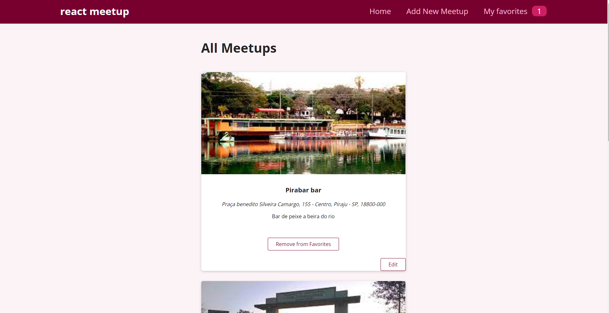

# React-Tutorial-2

####Um site simples que foi feito seguindo um tutorial (React Crash Course for Beginners 2021, from Academind on youtube).

####after the end of the tutorial, I found a way to save the favorites in localStorage and edit the meetups on the home page.(made by my own logic so there may be better ways to do it)

####still need to find a way to update the favorites after the meetup item being updated
